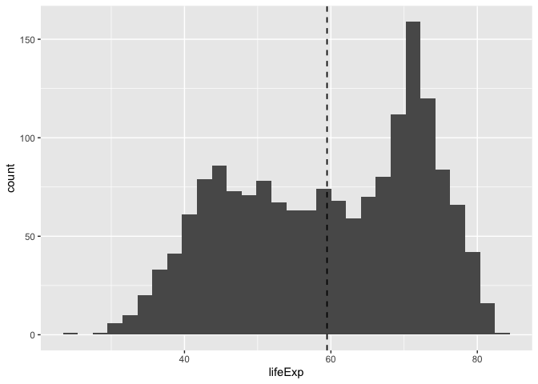
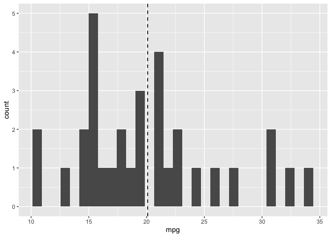

Assignment B-1: Making a function
================
Colton Stevens

Load the relevant packages.

``` r
library(tidyverse)
library(gapminder)
library(testthat)
```

## Exercise 1: Make a Function (25 points) and Exercise 2: Document your Function (20 points)

In this exercise, you’ll be making a function and fortifying it. The
function need not be complicated. The function need not be “serious”,
but shouldn’t be nonsense.

In the same code chunk where you made your function, document the
function using roxygen2 tags. Be sure to include:

1.  Title.
2.  Function description: In 1-2 brief sentences, describe what the
    function does.
3.  Document each argument with the @param tag, making sure to justify
    why you named the parameter as you did. (Justification for naming is
    not often needed, but we want to hear your reasoning.)
4.  What the function returns, using the @return tag.

This function takes in a dataframe and a numerical column in that
dataframe and outputs a data.frame of summary statistics (mean, median,
max, min, standard deviation, and count), as well as a histogram of that
column’s distribution.

``` r
#' Summary Statistics for a Numeric Column in a Dataframe
#' 
#' This function takes in a dataframe and a numerical column in that dataframe and outputs a data.frame of summary statistics (mean, median, max, min, standard deviation, and count), as well as a histogram of that column's distribution with a vertical line representing the mean.
#' @params data The data.frame to be inputted. This is named `data` because it describes what the first argument should be — a data.frame.
#' @params col The numerical column to be used for calculating summary statistics. This is named `col` because it describes what the second argument should be — a column.
#' @return A data.frame of summary statistics (mean, median, max, min, standard deviation, and count), as well as a histogram.
#' @examples
#' summary_stats_column(gapminder,lifeExp)
#' summary_stats_column(mtcars, mpg)

summary_stats_column <- function(data, col) {
  calculations <- dplyr::summarise(data,
                                   is_numeric = is.numeric({{col}}),
                                   class = class({{col}}))
  if(!calculations$is_numeric){
    stop("Selected column is not numeric. Column is: ", calculations$class)
  }

  summary_table <- data %>%
    dplyr::summarise(mean = mean({{col}}, na.rm = TRUE),
            median = median({{col}}, na.rm = TRUE),
            max = max({{col}}, na.rm = TRUE),
            min = min({{col}}, na.rm = TRUE),
            st_dev = sd({{col}}, na.rm = TRUE),
            count = n())
  
  summary_plot <- ggplot(data) +
    geom_histogram(aes({{col}}),
                   bins = 30) +
    geom_vline(aes(xintercept = mean({{col}})), 
             linetype = "dashed", size = 0.6)
  
  output <- list(summary_table, summary_plot)
  return(output)
}
```

## Exercise 3: Include examples (15 points)

Demonstrate the usage of your function with a few examples. Use one or
more new code chunks, describing what you’re doing.

Here are some examples. The first example
`summary_stats_column(gapminder, lifeExp)` creates a summary statistics
data.frame and histogram of the `lifeExp` column in the `gapminder`
data.frame.

``` r
summary_stats_column(gapminder, lifeExp)
```

    ## [[1]]
    ## # A tibble: 1 × 6
    ##    mean median   max   min st_dev count
    ##   <dbl>  <dbl> <dbl> <dbl>  <dbl> <int>
    ## 1  59.5   60.7  82.6  23.6   12.9  1704
    ## 
    ## [[2]]

<!-- --> The
second example `summary_stats_column(mtcars, mpg)` creates a summary
statistics data.frame and histogram of the `mpg` column in the `mtcars`
data.frame.

``` r
summary_stats_column(mtcars, mpg)
```

    ## [[1]]
    ##       mean median  max  min   st_dev count
    ## 1 20.09062   19.2 33.9 10.4 6.026948    32
    ## 
    ## [[2]]

<!-- -->

The third example `summary_stats_column(gapminder, country)` attempts to
create a summary statistics data.frame and histogram of the `country`
column in the `gapminder` data.frame, but it throws an error and stops
because the `country` column is not numeric.

``` r
summary_stats_column(gapminder, country)
```

    ## Error in summary_stats_column(gapminder, country): Selected column is not numeric. Column is: factor

## Exercise 4: Test the Function (25 points)

Running examples is a good way of checking by-eye whether your function
is working as expected. But, having a formal “yes or no” check is useful
when you move on to other parts of your analysis.

Write formal tests for your function. You should use at least three
non-redundant uses of an expect\_() function from the testthat package,
and they should be contained in a test_that() function (or more than
one). They should all pass.

``` r
test_that("The output is a list; the first item of the output is a data.frame, the second item of the output is a ggplot, and neither item is empty", {
  expect_true(is.list(summary_stats_column(gapminder, lifeExp)))
  expect_true(!is.null(summary_stats_column(gapminder, lifeExp)[[1]]))
  expect_true(!is.null(summary_stats_column(gapminder, lifeExp)[[2]]))
  expect_s3_class(summary_stats_column(gapminder, lifeExp)[[1]], "data.frame")
  expect_s3_class(summary_stats_column(gapminder, lifeExp)[[2]], "ggplot")
  })
```

    ## Test passed 🎊

``` r
test_that("Error occurs for incorrect column arguments (a non-numeric column and a NA column)", {
          expect_error(summary_stats_column(gapminder, country))
          expect_error(summary_stats_column(gapminder, NA))
  })
```

    ## Test passed 🥳

``` r
test_that("The first input is a dataframe", {
  expect_true(is.data.frame(gapminder))
  })
```

    ## Test passed 🥳
