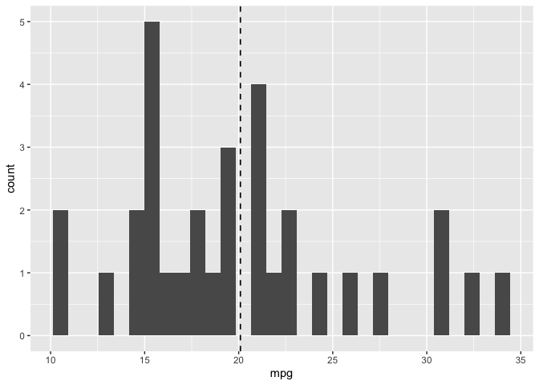

# Welcome to Colton Stevens's README file for the STAT545B Assignment B-2: Making an R package!

<!-- README.md is generated from README.Rmd. Please edit that file -->

# sumstat

The goal of sumstat is to provide a function that takes in a data.frame
and a numerical column in that dataframe and outputs a data.frame of
summary statistics (mean, median, max, min, standard deviation, and
count), as well as a histogram of that column’s distribution with a
vertical line representing the mean.

## Installation

sumstat is not yet on CRAN, but you can download it from this repository
using the following R command.

``` r
devtools::install_github("functions_skipperoooo/sumstat")
```

## Example

This example uses `summary_stats_column` on the `mpg` column of the
`mtcars` data.frame to create summary statistics and a histogram.

``` r
library(sumstat)
summary_stats_column(mtcars, mpg)
#> [[1]]
#>       mean median  max  min   st_dev count
#> 1 20.09062   19.2 33.9 10.4 6.026948    32
#> 
#> [[2]]
```



